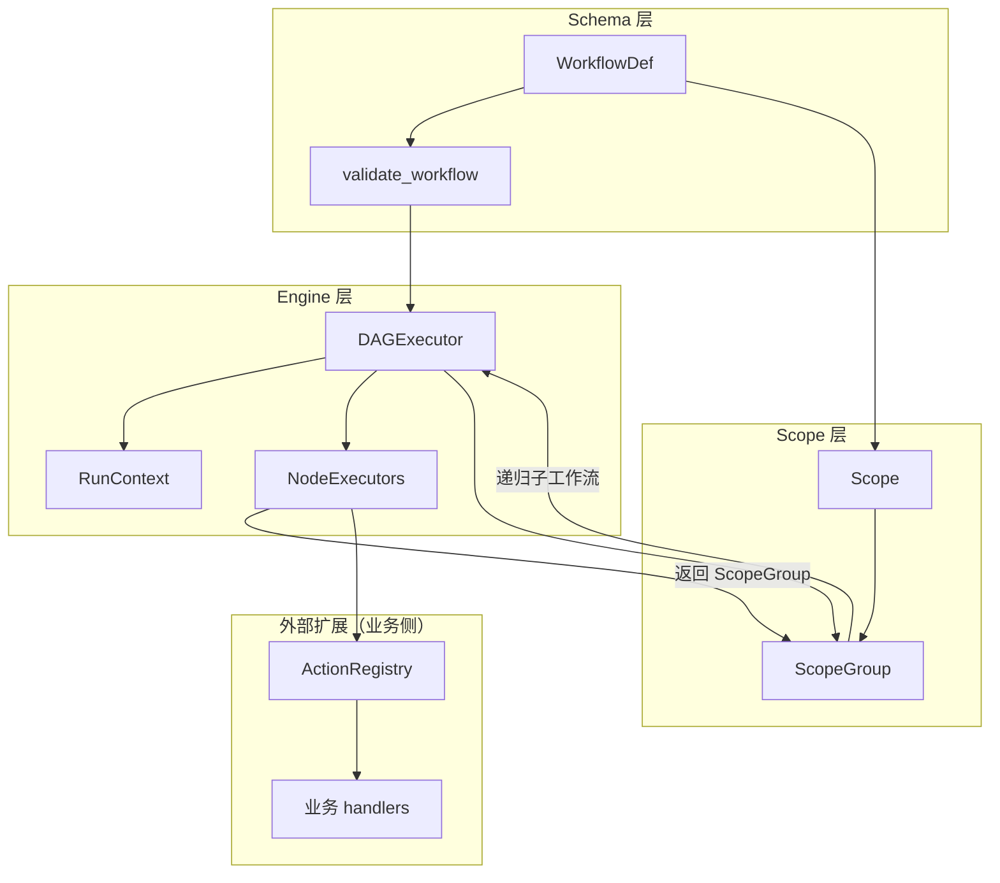
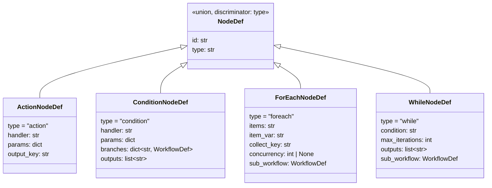
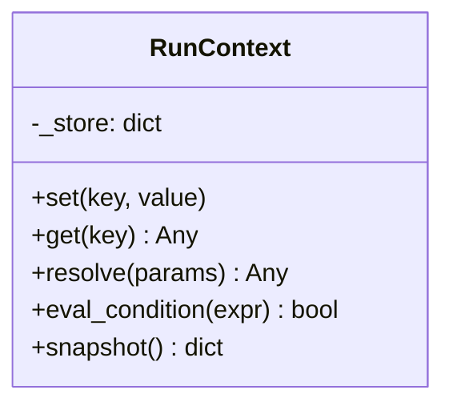
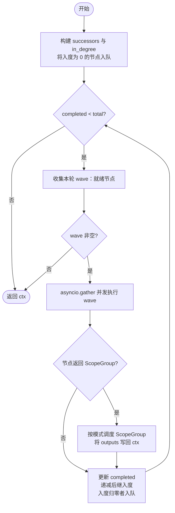
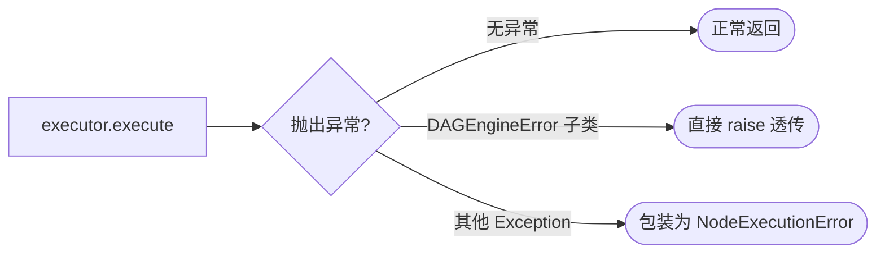
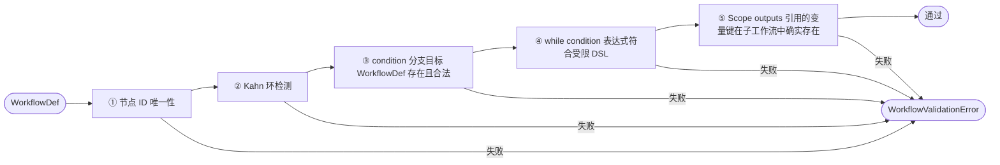
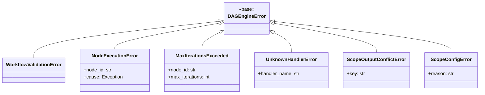

# DAG 工作流引擎 — 设计文档

> 本文档描述 **okflow** 独立库的核心设计，供实现与接入参考。
> okflow 是一个通用的异步 DAG 工作流执行引擎，与具体业务逻辑解耦，
> 通过 `ActionRegistry` 插件机制支持任意外部系统集成。

---

## 目录

1. [设计目标](#1-设计目标)
2. [整体架构](#2-整体架构)
3. [Schema 层：工作流定义](#3-schema-层工作流定义)
4. [Scope 与 ScopeGroup](#4-scope-与-scopegroup)
5. [RunContext：执行上下文](#5-runcontext执行上下文)
6. [NodeExecutor：节点执行器体系](#6-nodeexecutor节点执行器体系)
7. [DAGExecutor：调度引擎](#7-dagexecutor调度引擎)
8. [四种内置节点的行为细节](#8-四种内置节点的行为细节)
9. [静态校验管道](#9-静态校验管道)
10. [ActionRegistry：外部动作扩展接口](#10-actionregistry外部动作扩展接口)
11. [接入方式示例](#11-接入方式示例)
12. [附录：异常层次](#附录异常层次)

---

## 1. 设计目标

| 目标 | 说明 |
|------|------|
| **依赖驱动并发** | 节点只声明 `depends_on`，引擎自动并发执行无依赖关系的节点 |
| **通用控制流** | condition / foreach / while 是普通节点，通过创建 `ScopeGroup` 实现控制流，不需要引擎特殊处理 |
| **显式 I/O 边界** | Scope 有明确的 `outputs` 声明，子执行单元只能通过声明的出口影响父上下文 |
| **灵活并发控制** | ScopeGroup 的执行模式（exclusive / parallel / sequential / pooled）由节点动态声明，支持并发上限 |
| **异常透传层次** | 引擎内部异常直接抛出，节点业务异常包装为 `NodeExecutionError` |
| **可扩展节点类型** | 注册 `NodeExecutor` 子类即可添加新节点类型；自定义节点同样可以创建 `ScopeGroup` |
| **业务逻辑零侵入** | 引擎不依赖任何具体业务，通过 `ActionRegistry` 注册异步处理函数对接外部系统 |

---

## 2. 整体架构



**执行入口**：调用方将 `WorkflowDef` 和初始上下文包装为根 `Scope`，交给 `DAGExecutor` 运行。`DAGExecutor` 调度 Scope 内的节点；若节点返回 `ScopeGroup`，引擎按模式递归调度子 Scope。

---

## 3. Schema 层：工作流定义

### 3.1 WorkflowDef

```python
class WorkflowDef(BaseModel):
    id: str
    name: str
    nodes: list[NodeDef]   # 判别联合，按 type 字段分发
    edges: list[EdgeDef]   # 有向边列表，定义节点间的执行依赖关系

class EdgeDef(BaseModel):
    from_: str = Field(alias="from")   # 前置节点 ID
    to: str                            # 后继节点 ID
```

### 3.2 NodeDef 类型体系



**与原设计的关键变化：**

- `ConditionNodeDef.branches` 值类型从 `str`（节点 ID）改为 `WorkflowDef`，支持任意数量的具名分支（不限于 true/false）
- `ConditionNodeDef` 和 `WhileNodeDef` 新增 `outputs: list[str]`，显式声明哪些变量写回父上下文
- `ForEachNodeDef` 新增 `concurrency: int | None`，控制并发迭代上限
- `ForEachNodeDef` 和 `WhileNodeDef` 仍内嵌完整 `sub_workflow`，需调用 `model_rebuild()` 解析前向引用

---

## 4. Scope 与 ScopeGroup

### 4.1 Scope

**Scope** 是带显式输出边界的执行单元，包含一个子工作流及其 I/O 声明。

```python
class Scope:
    inputs: dict[str, Any]       # 显式传入子工作流的变量绑定
    inherit_parent: bool         # True：在 inputs 基础上继承父上下文全部变量
    outputs: list[str]           # 执行结束后提升到父上下文的变量键列表
    workflow: WorkflowDef        # 要执行的子工作流
```

**变量可见性规则：**

| `inherit_parent` | 子工作流可读的变量 | 可写回父上下文的变量 |
|------------------|--------------------|----------------------|
| `False`（隔离）  | 仅 `inputs` 中声明的变量 | 仅 `outputs` 中声明的变量 |
| `True`（透明）   | `inputs` 绑定 + 父上下文全部变量 | 仅 `outputs` 中声明的变量 |

- **foreach** 使用 `inherit_parent=False`：每次迭代完全隔离，防止跨迭代变量污染
- **condition / while** 使用 `inherit_parent=True`：分支/循环体需要读取父上下文中的任意变量，但写回仍受 `outputs` 约束

### 4.2 ScopeGroup

**ScopeGroup** 是一批 Scope 加上执行模式，由节点的 `execute()` 方法动态创建并返回给引擎。

```python
class ScopeGroup:
    scopes: list[Scope]
    mode: Literal["exclusive", "parallel", "sequential", "pooled"]

    # pooled 模式专用
    concurrency: int | None = None    # 最大并发数，None 表示不限
    collect_key: str | None = None    # 父上下文中收集结果列表的目标键

    # sequential + repeat 专用（while 节点使用）
    repeat: bool = False
    repeat_until: Callable[[RunContext], bool] | None = None
    max_iterations: int | None = None
```

**四种执行模式：**

| 模式 | 语义 | 典型场景 |
|------|------|---------|
| `exclusive` | 运行 `scopes` 列表中的所有 Scope（节点已预选，通常只有一个） | condition 分支 |
| `parallel` | 所有 Scope 完全并发运行 | fan-out |
| `sequential` | 顺序运行，前一个 Scope 的 outputs 自动注入下一个 Scope 的 inputs | pipeline |
| `pooled` | 并发运行，受 `concurrency` 限制；结果收集到 `collect_key` 指定的列表 | foreach 批量处理 |

### 4.3 ScopeGroup 结果写回规则

| 模式 | 结果如何写回父上下文 |
|------|-------------------|
| `exclusive` | 被运行的 Scope 的 outputs 直接提升 |
| `parallel` | 每个 Scope 的 outputs 各自提升（键名冲突时报 `ScopeOutputConflictError`） |
| `sequential`（非 repeat）| 最后一个 Scope 的 outputs 提升；中间 Scope 的 outputs 仅供下一 Scope 读取 |
| `sequential` + `repeat` | 每轮 outputs 提升到父上下文，供下一轮 `repeat_until` 条件判断 |
| `pooled` | 每个 Scope 的 outputs 按顺序收集为 `collect_key` 键下的列表 |

**`pooled` 收集示例：**

```
ScopeGroup(mode="pooled", collect_key="results")
  scope[item=A] → outputs: {"do_work.result": "x"}
  scope[item=B] → outputs: {"do_work.result": "y"}
  scope[item=C] → outputs: {"do_work.result": "z"}
           ↓
父上下文: "results" = ["x", "y", "z"]
```

### 4.4 sequential 模式的变量传递

引擎在 sequential 模式下顺序运行每个 Scope 后，将其 outputs 合并注入下一个 Scope 的 inputs（在已声明 inputs 基础上追加/覆盖）。用户无需手动声明跨 Scope 的变量传递，引擎自动处理。

```
scope[0] 执行完毕 → outputs: {"step1.result": "A"}
           ↓ 引擎将 outputs 注入 scope[1].inputs
scope[1] 执行（inputs 中有 "step1.result"）→ outputs: {"step2.result": "B"}
           ↓
...
```

### 4.5 整体结构示意

```
DAGExecutor
└── 根 Scope（顶层工作流）
    ├── ActionNode          ─ execute() 返回 None，不创建 Scope
    ├── ConditionNode       ─ execute() 返回 ScopeGroup(mode="exclusive")
    │   └── Scope(inherit_parent=True, outputs=[...], workflow=chosen_branch)
    ├── ForEachNode         ─ execute() 返回 ScopeGroup(mode="pooled")
    │   ├── Scope(inherit_parent=False, inputs={item_var: A}, outputs=[collect_key])
    │   ├── Scope(inherit_parent=False, inputs={item_var: B}, outputs=[collect_key])
    │   └── Scope(inherit_parent=False, inputs={item_var: C}, outputs=[collect_key])
    └── WhileNode           ─ execute() 返回 ScopeGroup(mode="sequential", repeat=True)
        └── Scope(inherit_parent=True, outputs=[...], workflow=sub_workflow)
```

---

## 5. RunContext：执行上下文

每个 Scope 在执行时拥有独立的 `RunContext` 实例。



### 5.1 变量命名约定

节点写入输出时键名为 `"{node_id}.{output_key}"`，下游节点通过 `$` 前缀引用：

```
fetch_data 节点 output_key="body" → ctx.set("fetch_data.body", result)
下游节点 params: {"input": "$fetch_data.body"} → resolve() 展开为实际值
```

### 5.2 $ref 解析

`resolve()` 递归处理 dict / list / str，将匹配 `^\$([a-zA-Z_][\w.]*)$` 的字符串替换为 ctx 中对应值：

```
"$fetch_data.body"     →  ctx.get("fetch_data.body") 的实际值
5                       →  5（原样）
["$tag_a", "static"]   →  [ctx.get("tag_a"), "static"]
```

### 5.3 条件 DSL

`eval_condition()` 支持受限表达式，不使用 `eval()`：

| 格式 | 示例 |
|------|------|
| `$ref is null` | `$result is null` |
| `$ref is not null` | `$result is not null` |
| `$ref OP value` | `$count < 5`、`$status == "ok"` |

右值类型自动推断：`true/false` → bool，`null` → None，整数 → int，浮点 → float，引号字符串 → str。

### 5.4 Scope 上下文的构建

引擎在运行 Scope 时构建其 `RunContext`：

```python
def build_ctx(scope: Scope, parent_ctx: RunContext) -> RunContext:
    store = {}
    if scope.inherit_parent:
        store.update(parent_ctx.snapshot())   # 继承父上下文全部变量
    store.update(scope.inputs)                # 显式 inputs 优先级更高（覆盖同名父变量）
    return RunContext(store)
```

---

## 6. NodeExecutor：节点执行器体系

### 6.1 抽象基类

```python
class NodeExecutor(ABC):
    @abstractmethod
    async def execute(
        self,
        node: Any,
        ctx: RunContext,
        registry: ActionRegistry,
    ) -> ScopeGroup | None:
        """
        返回 None：节点直接执行完毕，无子 Scope。
        返回 ScopeGroup：引擎按模式调度子 Scope。
        """
        ...
```

`graph` 参数从签名中移除——条件跳过逻辑由 `exclusive` 模式的 ScopeGroup 取代，节点不再需要感知图结构。

### 6.2 分发表

```python
_EXECUTORS: dict[NodeType, NodeExecutor] = {
    NodeType.ACTION:    ActionNodeExecutor(),
    NodeType.CONDITION: ConditionNodeExecutor(),
    NodeType.FOREACH:   ForEachNodeExecutor(),
    NodeType.WHILE:     WhileNodeExecutor(),
}
```

**新增节点类型**的步骤：
1. 定义新的 `NodeDef` 子类并加入判别联合
2. 实现 `NodeExecutor` 子类，`execute()` 返回 `ScopeGroup | None`
3. 注册到 `_EXECUTORS`

自定义节点可以创建任意模式的 ScopeGroup，无需修改调度引擎。

---

## 7. DAGExecutor：调度引擎

### 7.1 入口

```python
class DAGExecutor:
    def __init__(self, registry: ActionRegistry) -> None:
        self._registry = registry

    async def run(self, scope: Scope) -> RunContext:
        """运行一个 Scope，返回其执行后的 RunContext。"""
        ctx = build_ctx(scope, parent_ctx=RunContext())
        await self._run_workflow(scope.workflow, ctx)
        return ctx

    async def run_with_parent(self, scope: Scope, parent_ctx: RunContext) -> RunContext:
        """运行子 Scope，parent_ctx 用于 inherit_parent=True 的场景。"""
        ctx = build_ctx(scope, parent_ctx)
        await self._run_workflow(scope.workflow, ctx)
        return ctx
```

### 7.2 Kahn 算法 + Wave 并发



### 7.3 ScopeGroup 调度

```python
async def _run_scope_group(
    self, group: ScopeGroup, parent_ctx: RunContext
) -> None:
    match group.mode:
        case "exclusive":
            await self._run_exclusive(group, parent_ctx)
        case "parallel":
            await self._run_parallel(group, parent_ctx)
        case "sequential":
            await self._run_sequential(group, parent_ctx)
        case "pooled":
            await self._run_pooled(group, parent_ctx)
```

各模式的核心逻辑：

- **exclusive**：顺序运行 `group.scopes`（节点已预选，通常只有一个），将 outputs 提升至 `parent_ctx`
- **parallel**：`asyncio.gather` 并发运行所有 Scope；outputs 键名冲突时抛 `ScopeOutputConflictError`
- **sequential**（非 repeat）：顺序运行，每轮 outputs 注入下一个 Scope 的 inputs；最后一个 Scope 的 outputs 提升至 `parent_ctx`
- **sequential + repeat**：反复运行同一 Scope，每轮 outputs 提升至 `parent_ctx`，然后检查 `repeat_until(parent_ctx)`；超出 `max_iterations` 时抛 `MaxIterationsExceeded`
- **pooled**：semaphore 限流的并发；每个 Scope 的 outputs 收集到 `parent_ctx[group.collect_key]` 列表

### 7.4 异常处理策略



---

## 8. 四种内置节点的行为细节

### 8.1 ActionNode

```
resolve($ref) → registry.call(handler, params) → ctx.set("{id}.{output_key}", result)
返回 None（不创建 Scope）
```

### 8.2 ConditionNode

handler 返回分支键（字符串），节点从 `branches` 中取出对应 `WorkflowDef`，创建一个 `inherit_parent=True` 的 Scope，打包为 `exclusive` ScopeGroup 返回：

```python
branch_key = str(await registry.call(node.handler, resolved_params))
chosen_workflow = node.branches[branch_key]   # 支持任意数量具名分支

scope = Scope(
    inputs={},                    # 无额外绑定
    inherit_parent=True,          # 继承父上下文全部变量
    outputs=node.outputs,         # 显式声明写回父上下文的变量
    workflow=chosen_workflow,
)
return ScopeGroup(scopes=[scope], mode="exclusive")
```

**与原设计的对比：**
- 不再需要 BFS 级联标记跳过节点——未选中分支从不创建 Scope，自然不执行
- 菱形汇聚问题消失——Scope 执行完后统一在边界处写回，不存在"跳过传播"的问题
- 支持任意数量分支（`branches` 是 dict，不限于 true/false）

### 8.3 ForEachNode

为每个 item 创建独立 Scope，打包为 `pooled` ScopeGroup：

```python
items = ctx.resolve(node.items)
scopes = [
    Scope(
        inputs={node.item_var: item},
        inherit_parent=False,     # 完全隔离，防止迭代间变量污染
        outputs=[node.collect_key],
        workflow=node.sub_workflow,
    )
    for item in items
]
return ScopeGroup(
    scopes=scopes,
    mode="pooled",
    concurrency=node.concurrency,       # None 表示不限并发
    collect_key=f"{node.id}.collected", # 父上下文中收集结果的目标键
)
```

每个 Scope 执行后，`node.collect_key` 对应的值按顺序收集为父上下文 `{node.id}.collected` 的列表。

**pooled 模式的单键约束**：pooled 模式下每个 Scope 只允许声明一个 outputs 键，违反时在校验阶段抛 `ScopeConfigError`。若子工作流需要输出多个值，应将其打包为单个结构体（dict）写入 `output_key`。

### 8.4 WhileNode

创建一个 `sequential + repeat` 的 ScopeGroup，引擎在每轮执行后检查终止条件：

```python
scope = Scope(
    inputs={},
    inherit_parent=True,              # 循环体需要读取并修改父上下文的变量
    outputs=node.outputs,             # 声明循环体哪些写入会影响父上下文（含条件变量）
    workflow=node.sub_workflow,
)
return ScopeGroup(
    scopes=[scope],
    mode="sequential",
    repeat=True,
    repeat_until=lambda ctx: not ctx.eval_condition(node.condition),
    max_iterations=node.max_iterations,
)
```

**为什么 while 使用 `inherit_parent=True`？**
循环体需要修改触发条件的变量（如 `$count`）并将其写回父上下文，否则条件永远不变，循环无法退出。通过 `outputs` 显式声明哪些变量写回，防止意外污染其他父上下文变量。

---

## 9. 静态校验管道

`validate_workflow()` 在执行前按顺序运行以下检查：



新增第 ⑤ 步：校验 `outputs` 中声明的变量键是否能在对应子工作流中被某个节点写入，防止"声明了 output 但子工作流里没有节点产生该变量"的静默错误。

所有检查均对 `sub_workflow` 递归执行。

---

## 10. ActionRegistry：外部动作扩展接口

`ActionRegistry` 是引擎与外部系统之间的**唯一边界**，设计不变。

```python
class ActionRegistry:
    def __init__(self) -> None:
        self._handlers: dict[str, Callable[..., Awaitable[Any]]] = {}

    def register(self, name: str, handler: Callable[..., Awaitable[Any]]) -> None:
        self._handlers[name] = handler

    async def call(self, handler_name: str, params: dict) -> Any:
        fn = self._handlers.get(handler_name)
        if fn is None:
            raise UnknownHandlerError(handler_name)
        return await fn(**params)
```

注册方式：

```python
registry = ActionRegistry()

# 直接注册
registry.register("http.get", fetch)

# 装饰器风格
def action(name: str):
    def decorator(fn):
        registry.register(name, fn)
        return fn
    return decorator

@action("my_app.process")
async def process(data: dict) -> dict:
    return {"result": data["value"] * 2}
```

---

## 11. 接入方式示例

### 11.1 完整接入流程

```python
import asyncio, json
from okflow import DAGExecutor, WorkflowDef, ActionRegistry, Scope
from okflow.schema.validators import validate_workflow

registry = ActionRegistry()

@action("data.fetch")
async def fetch_data(source: str) -> list: ...

@action("data.transform")
async def transform(item: dict) -> dict: ...

@action("builtin.is_nonempty")
async def is_nonempty(value) -> str:
    return "true" if value else "false"

# 加载并校验
with open("workflow.json") as f:
    workflow = WorkflowDef.model_validate(json.load(f))
validate_workflow(workflow)

# 执行
async def main():
    root_scope = Scope(
        inputs={"source": "https://api.example.com/items"},
        inherit_parent=False,
        outputs=["foreach_node.collected"],
        workflow=workflow,
    )
    ctx = await DAGExecutor(registry).run(root_scope)
    print(ctx.get("foreach_node.collected"))

asyncio.run(main())
```

### 11.2 异常处理

```python
from okflow.exceptions import (
    DAGEngineError,
    WorkflowValidationError,
    NodeExecutionError,
    MaxIterationsExceeded,
    UnknownHandlerError,
    ScopeOutputConflictError,
)

try:
    ctx = await DAGExecutor(registry).run(root_scope)
except WorkflowValidationError as e:
    print(f"工作流配置错误: {e}")
except MaxIterationsExceeded as e:
    print(f"节点 {e.node_id} 超出最大迭代次数 {e.max_iterations}")
except NodeExecutionError as e:
    print(f"节点 {e.node_id} 执行失败: {e.cause}")
except ScopeOutputConflictError as e:
    print(f"parallel 模式 outputs 键名冲突: {e.key}")
except DAGEngineError as e:
    print(f"引擎错误: {e}")
```

---

## 附录：异常层次



`DAGEngineError` 子类在节点执行时直接透传，非引擎异常包装为 `NodeExecutionError`。新增 `ScopeOutputConflictError`，用于 `parallel` 模式下多个 Scope 写入同一 outputs 键的场景。
