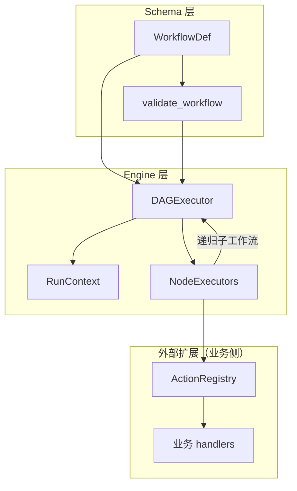
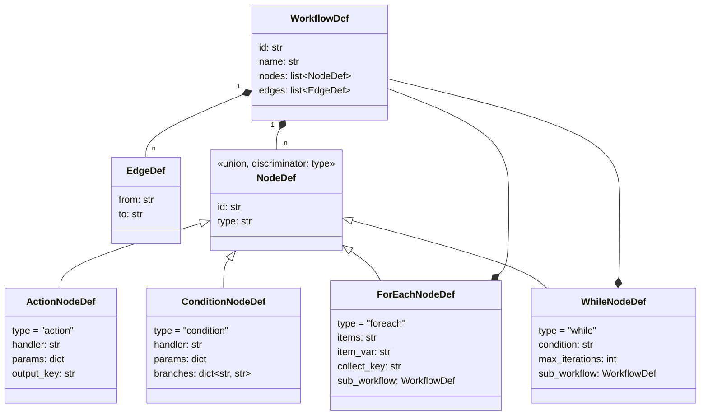
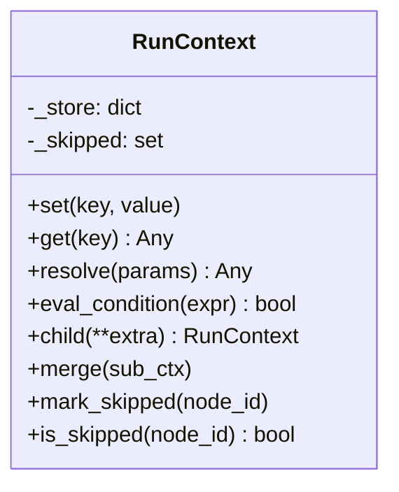
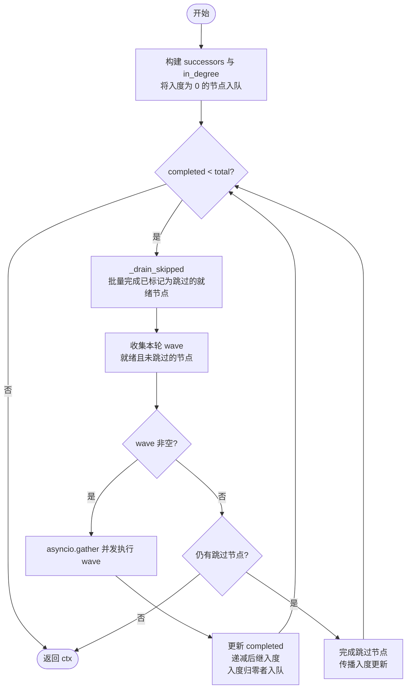
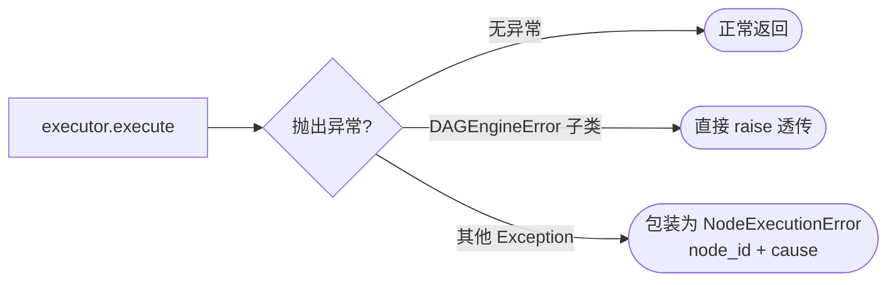
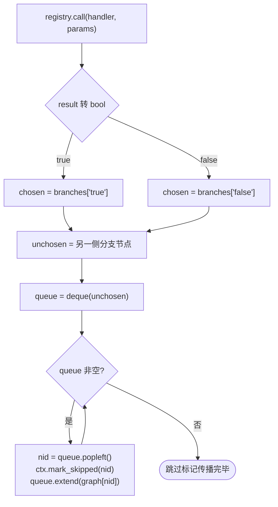
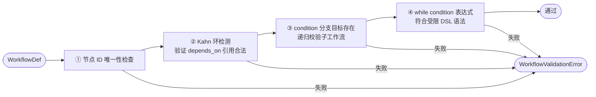
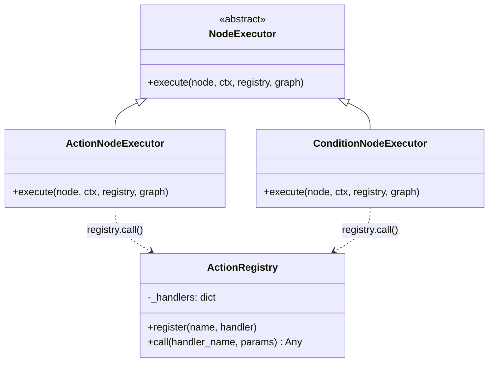
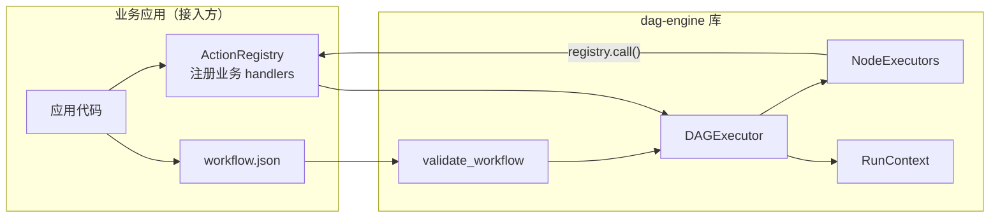
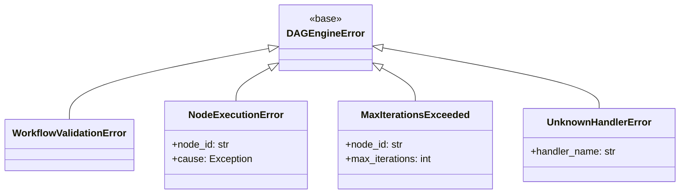

# DAG 工作流引擎 — 设计文档

> 本文档描述 **dag-engine** 独立库的核心设计，供实现与接入参考。
> dag-engine 是一个通用的异步 DAG 工作流执行引擎，与具体业务逻辑解耦，
> 通过 `ActionRegistry` 插件机制支持任意外部系统集成。

---

## 目录

1. [设计目标](#1-设计目标)
2. [整体架构](#2-整体架构)
3. [Schema 层：工作流定义](#3-schema-层工作流定义)
4. [RunContext：执行上下文](#4-runcontext执行上下文)
5. [NodeExecutor：节点执行器体系](#5-nodeexecutor节点执行器体系)
6. [DAGExecutor：调度引擎](#6-dagexecutor调度引擎)
7. [四种内置节点的行为细节](#7-四种内置节点的行为细节)
8. [静态校验管道](#8-静态校验管道)
9. [ActionRegistry：外部动作扩展接口](#9-actionregistry外部动作扩展接口)
10. [接入方式示例](#10-接入方式示例)

---

## 1. 设计目标

| 目标 | 说明 |
|------|------|
| **依赖驱动并发** | 节点不指定执行顺序，只声明 `depends_on`，引擎自动并发执行无依赖关系的节点 |
| **结构化控制流** | 支持条件分支（condition）、列表迭代（foreach）、条件循环（while）嵌套子工作流 |
| **上下文隔离与共享** | foreach 每次迭代创建子上下文，while 与父共享上下文；两种语义都有明确用途 |
| **快速跳过** | condition 节点选择分支后，未选分支的所有下游节点通过 BFS 级联标记，无需等待 wave 轮次 |
| **异常透传层次** | 引擎内部异常直接抛出，节点业务异常包装为 `NodeExecutionError` |
| **可扩展节点类型** | 通过注册 `NodeExecutor` 子类即可添加新节点类型，无需修改调度引擎 |
| **业务逻辑零侵入** | 引擎不依赖任何具体业务，通过 `ActionRegistry` 注册异步处理函数对接外部系统 |

---

## 2. 整体架构



---

## 3. Schema 层：工作流定义

### 3.1 WorkflowDef

```python
class WorkflowDef(BaseModel):
    id: str
    name: str
    nodes: list[NodeDef]   # 判别联合，按 type 字段分发
    edges: list[EdgeDef]   # 有向边列表，定义节点间的执行依赖关系

class EdgeDef(BaseModel):
    from_: str = Field(alias="from")   # 前置节点 ID
    to: str                            # 后继节点 ID
```

工作流以 JSON 或 dict 加载，Pydantic 负责反序列化与类型校验。引擎在运行时遍历 `edges` 构建后继节点表（`successors`）和入度表（`in_degree`）。

### 3.2 NodeDef 类型体系



**关键设计点：**

- `handler` 是引擎唯一关心的字段——它是 `ActionRegistry` 中注册的处理器名称，引擎不感知其背后的实现。
- 节点间的依赖关系通过顶层 `edges`（`from` / `to`）声明，引擎从中构建后继节点表（`successors`）和入度表（`in_degree`）。节点本身不内嵌依赖信息，保持节点定义与图拓扑分离。
- `ForEachNodeDef` 和 `WhileNodeDef` 内嵌完整的 `sub_workflow`，形成递归结构，因此需要调用 `model_rebuild()` 来解析前向引用。
- 判别联合（`discriminator="type"`）让 Pydantic 在反序列化时按 `type` 字段自动路由到正确的子模型，无需手动 `if/elif`。

### 3.3 工作流 JSON 示例

```json
{
  "id": "example_workflow",
  "name": "示例工作流",
  "nodes": [
    {
      "id": "fetch_list",
      "type": "action",
      "handler": "http.get",
      "params": { "url": "https://api.example.com/items" },
      "output_key": "items"
    },
    {
      "id": "check_nonempty",
      "type": "condition",
      "handler": "builtin.is_truthy",
      "params": { "value": "$fetch_list.items" },
      "branches": { "true": "process_each", "false": "notify_empty" }
    },
    {
      "id": "process_each",
      "type": "foreach",
      "items": "$fetch_list.items",
      "item_var": "item",
      "collect_key": "result",
      "sub_workflow": {
        "id": "process_item",
        "name": "处理单个元素",
        "nodes": [
          {
            "id": "do_work",
            "type": "action",
            "handler": "my_app.process",
            "params": { "data": "$item" },
            "output_key": "result"
          }
        ],
        "edges": []
      }
    },
    {
      "id": "notify_empty",
      "type": "action",
      "handler": "notify.send",
      "params": { "message": "列表为空，跳过处理" }
    }
  ],
  "edges": [
    { "from": "fetch_list",    "to": "check_nonempty" },
    { "from": "check_nonempty", "to": "process_each"  },
    { "from": "check_nonempty", "to": "notify_empty"  }
  ]
}
```

---

## 4. RunContext：执行上下文

`RunContext` 是整个执行过程的"内存空间"，承担三项职责：



### 4.1 变量命名约定

节点写入输出时键名为 `"{node_id}.{output_key}"`，下游节点通过 `$` 前缀引用：

```json
{ "id": "fetch_data", "type": "action", "handler": "http.get",
  "params": { "url": "https://api.example.com/data" }, "output_key": "body" }
```

```json
{ "id": "process", "type": "action", "handler": "my_app.transform",
  "params": { "input": "$fetch_data.body" }, "depends_on": ["fetch_data"] }
```

执行后 `fetch_data.body` 写入 ctx，`process` 节点的 `$fetch_data.body` 在执行前由 `resolve()` 展开为实际值。

### 4.2 $ref 解析

`resolve()` 递归处理 dict / list / str，将匹配 `^\$([a-zA-Z_][\w.]*)$` 的字符串替换为 ctx 中对应的值。非 `$ref` 字面量原样返回。

```
"$fetch_data.body"     →  ctx.get("fetch_data.body") 的实际值
5                       →  5（原样）
["$tag_a", "static"]   →  [ctx.get("tag_a"), "static"]
```

### 4.3 条件 DSL

`eval_condition()` 支持受限表达式，不使用 `eval()`，安全可预期：

| 格式 | 示例 |
|------|------|
| `$ref is null` | `$result is null` |
| `$ref is not null` | `$result is not null` |
| `$ref OP value` | `$count < 5`、`$status == "ok"` |

右值类型自动推断：`true/false` → bool，`null` → None，整数 → int，浮点 → float，引号字符串 → str。

### 4.4 子上下文语义

| 节点类型 | 子上下文策略 | 原因 |
|----------|-------------|------|
| `foreach` | `ctx.child(**{item_var: item})` — 每次迭代创建独立副本 | 防止迭代间变量污染；父上下文不受子工作流写入影响 |
| `while` | 直接传入 `ctx`（共享） | 子工作流对变量的修改要能影响下次迭代的条件判断 |

---

## 5. NodeExecutor：节点执行器体系

### 5.1 抽象基类

```python
class NodeExecutor(ABC):
    @abstractmethod
    async def execute(
        self,
        node: Any,
        ctx: RunContext,
        registry: ActionRegistry,
        graph: dict[str, list[str]],
    ) -> None: ...
```

四个参数的含义：

| 参数 | 类型 | 用途 |
|------|------|------|
| `node` | 各 NodeDef 子类 | 节点配置（handler、params、branches 等） |
| `ctx` | `RunContext` | 变量读写、条件求值、标记跳过 |
| `registry` | `ActionRegistry` | 调用已注册的处理函数（与外部系统交互） |
| `graph` | `dict[str, list[str]]` | 后继节点表，condition 节点 BFS 跳过时需要遍历下游 |

### 5.2 分发表（dispatch table）

```python
_EXECUTORS: dict[NodeType, NodeExecutor] = {
    NodeType.ACTION:    ActionNodeExecutor(),
    NodeType.CONDITION: ConditionNodeExecutor(),
    NodeType.FOREACH:   ForEachNodeExecutor(),
    NodeType.WHILE:     WhileNodeExecutor(),
}
```

模块级单例，不持有状态，并发安全。**新增节点类型**只需三步：
1. 定义新的 `NodeDef` 子类并加入判别联合
2. 实现对应的 `NodeExecutor` 子类
3. 注册到 `_EXECUTORS`

---

## 6. DAGExecutor：调度引擎

### 6.1 Kahn 算法 + Wave 并发



**关键数据结构：**

```
nodes_by_id  : dict[str, NodeDef]       — O(1) 按 ID 查节点
successors   : dict[str, list[str]]      — node_id → 下游节点 ID 列表
in_degree    : dict[str, int]            — 各节点当前未完成前置数量
ready        : deque[str]                — 入度为 0 的节点队列（FIFO）
completed    : set[str]                  — 已完成节点（含跳过）
```

### 6.2 _drain_skipped：不动点迭代

```python
changed = True
while changed:
    changed = False
    skipped = [nid for nid in ready if ctx.is_skipped(nid) and nid not in completed]
    for nid in skipped:
        ready.remove(nid)
        completed.add(nid)
        for succ in successors[nid]:
            in_degree[succ] -= 1
            if in_degree[succ] == 0:
                ready.append(succ)
                changed = True  # 有新节点就绪，继续扫描
```

这一步是**不动点迭代（fixed-point iteration）**：反复扫描直到没有新的 skipped 节点出现。确保 condition 节点的 BFS 标记能在同一 wave 循环内快速传播到所有下游节点，不引入额外 wave 延迟。

### 6.3 异常处理策略



区分"引擎内部预期异常"和"节点业务异常"，上层可以按类型选择性捕获。

---

## 7. 四种内置节点的行为细节

### 7.1 ActionNode

```
resolve($ref) → registry.call(handler, params) → ctx.set("{id}.{output_key}", result)
```

最简单的节点，无分支影响，`graph` 参数未使用。

### 7.2 ConditionNode — BFS 级联跳过



**为什么用 BFS 而非 DFS？** 两者效果等价（只是遍历顺序不同），BFS 用 `deque` 实现更直观，且标记顺序与后续 drain 顺序一致，便于调试。

### 7.3 ForEachNode — 子上下文隔离

```python
items = ctx.resolve(node.items)        # 解析 $ref → 实际列表
for item in items:                      # 顺序迭代，不并发
    sub_ctx = ctx.child(**{node.item_var: item})  # 独立副本，继承父变量
    await DAGExecutor(node.sub_workflow, registry).run(sub_ctx)
    if node.collect_key:
        collected.append(sub_ctx.get(node.collect_key, None))
if node.collect_key:
    ctx.set(f"{node.id}.collected", collected)
```

**collect_key None 占位**：保证 `collected` 列表长度与 `items` 长度一致，方便上游 zip 对应。

**延迟导入**：`foreach.py` 和 `while_.py` 在 `execute()` 内部导入 `DAGExecutor`，避免 `executor.py ↔ nodes/` 的循环导入。

### 7.4 WhileNode — 共享上下文 + 上界保护

```python
for _ in range(node.max_iterations):
    if not ctx.eval_condition(node.condition):
        return                          # 正常退出
    await DAGExecutor(node.sub_workflow, registry).run(ctx)  # 共享 ctx！
raise MaxIterationsExceeded(node.id, node.max_iterations)
```

**为什么 while 共享 ctx 而 foreach 用子上下文？**

- `while` 的语义是"直到条件为假"，子工作流必须能修改触发条件的变量（如 `$count`），否则循环永远不会退出。
- `foreach` 的语义是"对每个元素执行相同操作"，各次迭代逻辑上独立，不应互相干扰。

---

## 8. 静态校验管道

在工作流进入执行前，`validate_workflow()` 按顺序运行四项检查：



`_check_branch_targets` 和 `_check_no_cycles` 均对 foreach/while 的 `sub_workflow` 递归调用 `validate_workflow`，保证嵌套工作流也经过完整校验。

---

## 9. ActionRegistry：外部动作扩展接口

`ActionRegistry` 是引擎与外部系统之间的**唯一边界**。引擎只通过 `registry.call(handler, params)` 发起调用，不感知背后的实现细节。



### 9.1 接口定义

```python
from typing import Any, Callable, Awaitable

class ActionRegistry:
    """引擎的外部动作注册表。业务侧向此注册异步处理函数，引擎通过名称调用。"""

    def __init__(self) -> None:
        self._handlers: dict[str, Callable[..., Awaitable[Any]]] = {}

    def register(self, name: str, handler: Callable[..., Awaitable[Any]]) -> None:
        """注册一个处理函数。name 对应工作流节点中的 handler 字段。"""
        self._handlers[name] = handler

    async def call(self, handler_name: str, params: dict) -> Any:
        """按名称调用已注册的处理函数，将 params 展开为关键字参数。"""
        fn = self._handlers.get(handler_name)
        if fn is None:
            raise UnknownHandlerError(handler_name)
        return await fn(**params)
```

### 9.2 注册方式

支持直接注册异步函数，也支持装饰器风格：

```python
registry = ActionRegistry()

# 方式一：直接注册
async def fetch(url: str) -> dict:
    async with httpx.AsyncClient() as client:
        return (await client.get(url)).json()

registry.register("http.get", fetch)

# 方式二：装饰器（可自行封装）
def action(name: str):
    def decorator(fn):
        registry.register(name, fn)
        return fn
    return decorator

@action("my_app.process")
async def process(data: dict) -> dict:
    return {"result": data["value"] * 2}
```

---

## 10. 接入方式示例

### 10.1 完整接入流程

```python
import asyncio
import json
from dagengine import DAGExecutor, WorkflowDef, ActionRegistry
from dagengine.schema.validators import validate_workflow

# 1. 创建注册表，注册业务处理函数
registry = ActionRegistry()

@action("data.fetch")
async def fetch_data(source: str) -> list:
    ...

@action("data.transform")
async def transform(item: dict) -> dict:
    ...

@action("builtin.is_truthy")
async def is_truthy(value) -> bool:
    return bool(value)

# 2. 加载工作流定义
with open("workflow.json") as f:
    workflow = WorkflowDef.from_dict(json.load(f))

validate_workflow(workflow)   # 静态校验，失败时抛 WorkflowValidationError

# 3. 执行
async def main():
    ctx = await DAGExecutor(workflow, registry).run()
    print(ctx.get("process_each.collected"))

asyncio.run(main())
```

### 10.2 层次关系



### 10.3 异常处理

```python
from dagengine.exceptions import (
    DAGEngineError,
    WorkflowValidationError,
    NodeExecutionError,
    MaxIterationsExceeded,
    UnknownHandlerError,
)

try:
    ctx = await DAGExecutor(workflow, registry).run()
except WorkflowValidationError as e:
    # 工作流定义本身有问题（环、重复 ID 等）
    print(f"工作流配置错误: {e}")
except MaxIterationsExceeded as e:
    # while 节点超出最大迭代次数
    print(f"节点 {e.node_id} 超出最大迭代次数 {e.max_iterations}")
except NodeExecutionError as e:
    # 某个节点的业务逻辑抛出了异常
    print(f"节点 {e.node_id} 执行失败: {e.cause}")
except DAGEngineError as e:
    # 其他引擎级别错误
    print(f"引擎错误: {e}")
```

---

## 附录：异常层次



`DAGEngineError` 子类在 `_execute_one` 中直接透传，非引擎异常包装为 `NodeExecutionError`。调用方可以用 `except DAGEngineError` 统一捕获引擎级别的失败，也可以单独捕获 `NodeExecutionError` 处理节点业务失败。
